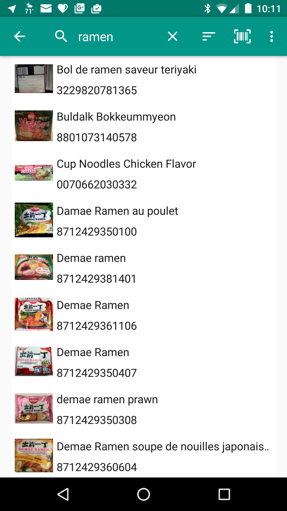
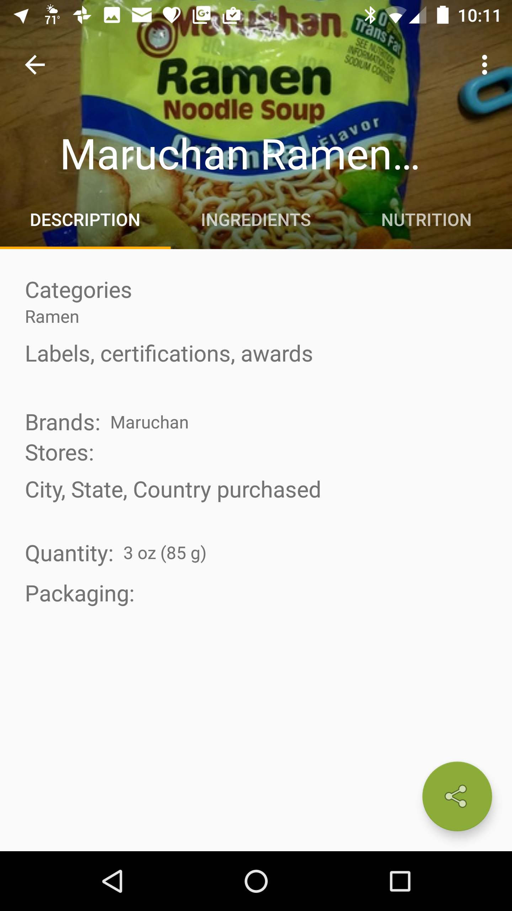
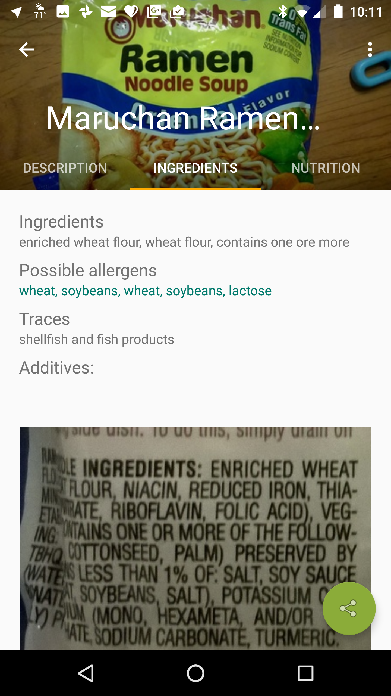
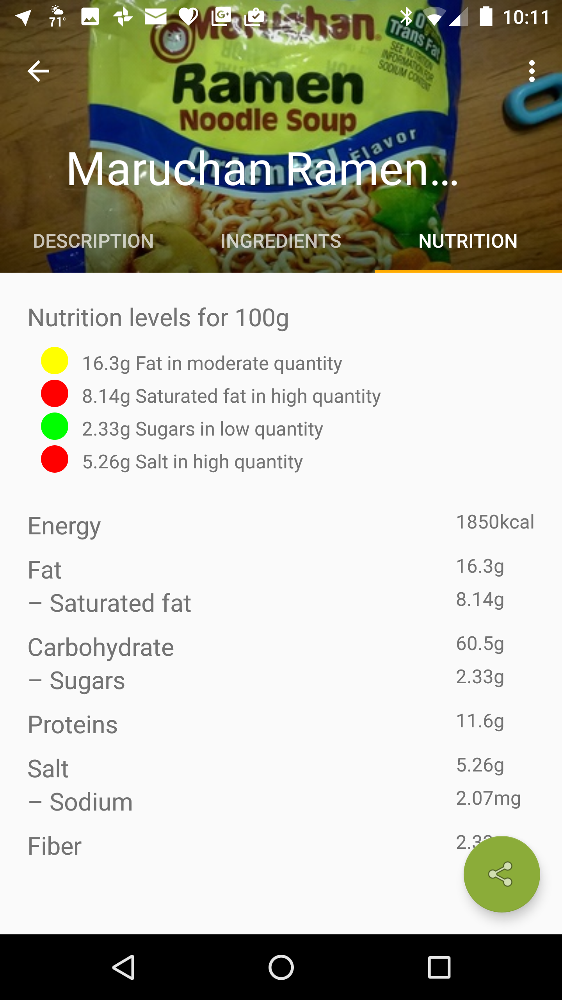
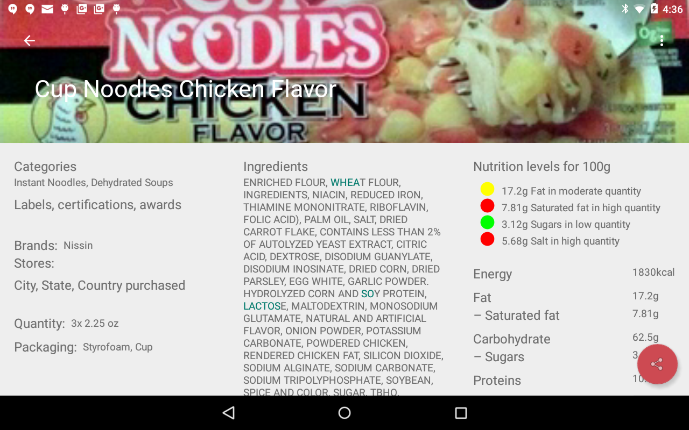
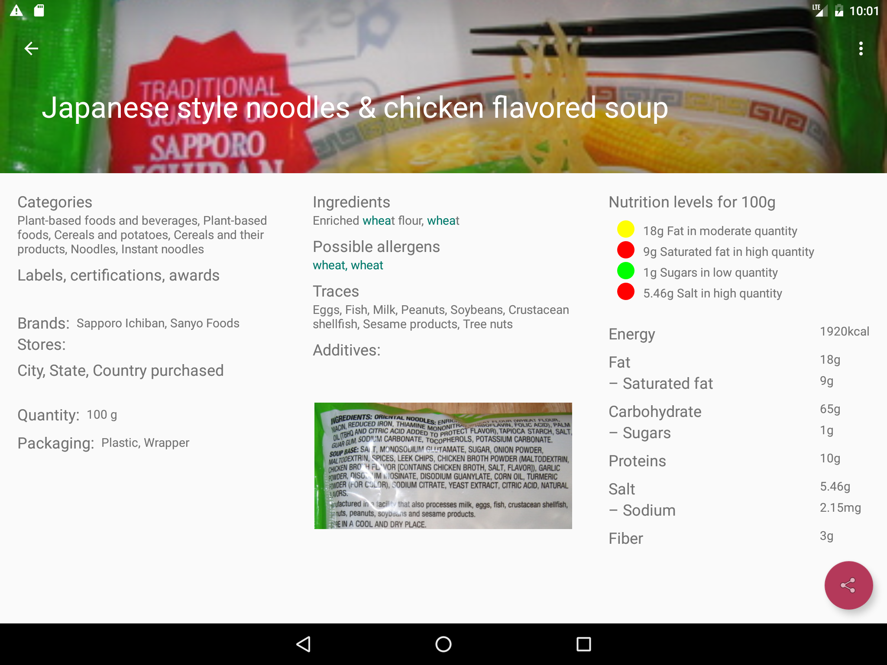

# Nutriscope

## Open Food Facts Browser for Android

Allows the user to search the Open Food Facts Database using text or UPC, resulting in a list of items that the user can select to view ingredient and nutritional details. If the device has a rear facing camera the app allows the user to scan a UPC.

### Screen Shot Summary

This was developed as a Capstone Project as part of the Android Developer Nanodegree program at Udacity.

### Prerequisities

This app is available via the [Google Play Store](https://play.google.com/store/apps/details?id=com.creationgroundmedia.nutriscope.paid), or you can build it and sideload it onto any Android device or Android emulator running 4.0.3 or later.

### Installing

After cloning the repository, build and install using [this guideline](http://developer.android.com/tools/building/building-cmdline.html)

## Using

From the main screen, press the search icon or the scan icon in the action bar to bring up the search widget. Enter a search term or UPC, then press the search icon at the bottom right to launch the search. Search results will appear as a list on the main screen. Press any item to show details about the product. The detail view includes three sections:
- DESCRPTION: details about categories, labels, brands, stores, locations, and packaging.
- INGREDIENTS: a list of ingredients with possible allergens highlighted, a list of possible allergens, a list of traces, a list of additives, and a photo of the ingredients list on the physical package.
- NUTRITION: nutrition levels for 100g followed by amounts for energy, fats, carbohydrates, proteins, salt, and fiber.

On smaller devices the sections appear in a tabbed view. On larger wide devices they appear in a single page.

## Authors

* **George Cohn** - *Initial work* - https://github.com/GeoCohn

## License

Copyright 2016 George Cohn III

Licensed under the Apache License, Version 2.0 (the "License");
you may not use this file except in compliance with the License.
You may obtain a copy of the License at

    http://www.apache.org/licenses/LICENSE-2.0

Unless required by applicable law or agreed to in writing, software
distributed under the License is distributed on an "AS IS" BASIS,
WITHOUT WARRANTIES OR CONDITIONS OF ANY KIND, either express or implied.
See the License for the specific language governing permissions and
limitations under the License.

## Full Screen shots

### Search screen

### Detail screen DESCRIPTION Tab

### Detail screen INGREDIENTS Tab

### Detail screen NUTRITION Tab

### Detail screen wide tablet

### Detail screen wide tablet

